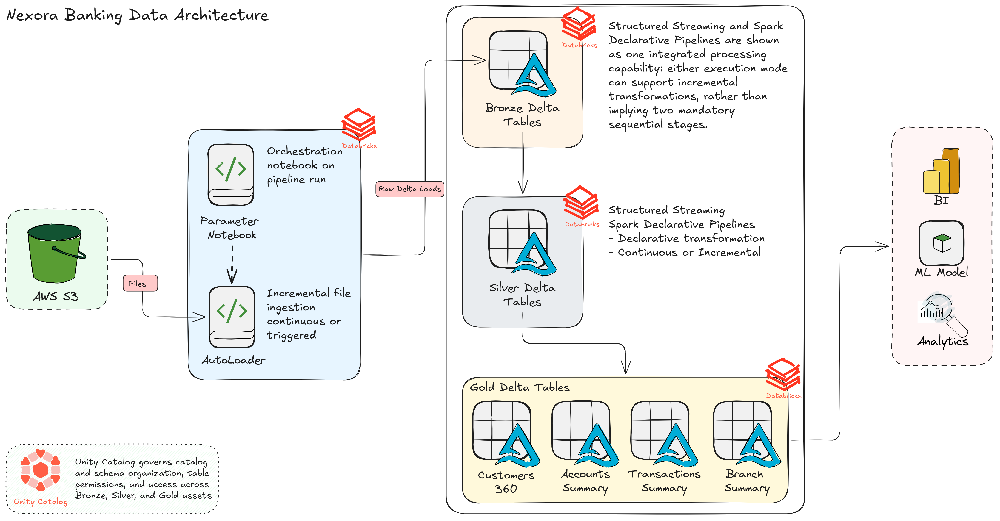
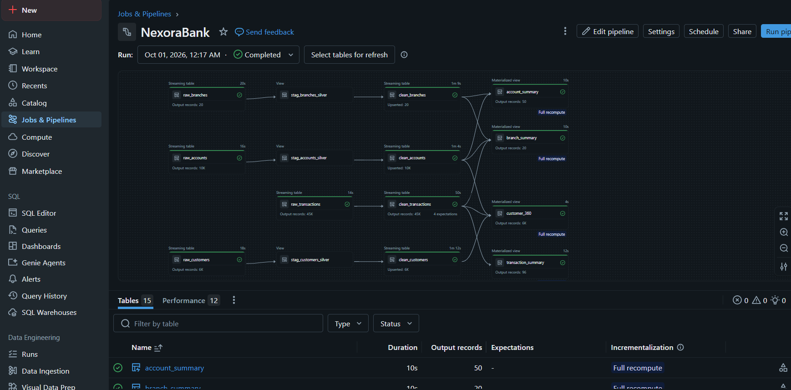

# Nexora-Banking-Data-Engineering-Pipeline

Nexora is an end-to-end banking data engineering project built using the Medallion Architecture and Unity Catalog. The pipeline ingests banking data using Auto Loader, Spark Declarative Pipelines, Structured Streaming, incremental processing, and SCD to transform raw data through the Silver layer into clean, business-ready Gold datasets.

---
## About Nexora Bank
Nexora Bank is a fictional modern banking institution serving customers through multiple branches and digital banking channels. The project focuses on building a scalable data engineering pipeline to process customer, account, branch, and transaction data for analytics and reporting.

---

## Tech Stack
**Python** – Pipeline development and data processing \
**Apache Spark (PySpark)** – Distributed data processing \
**SQL** – Querying and analyzing structured data \
**Databricks** – Data engineering, orchestration, and pipeline development \
**Delta Lake** - Reliable storage and incremental processing \
**AWS S3** – Cloud storage for source files and data ingestion \
**Auto Loader** – Incremental ingestion of new files from cloud storage \
**Unity Catalog** – Data governance, cataloging, and access control \
**Git & GitHub** – Version control and project management

---

## Architecture Overview



---

## Data Source

The project uses synthetic banking data generated with Python for development, testing, and pipeline validation. The datasets represent four core banking entities:

**Customers** – Customer details and KYC information \
**Accounts** – Account Details, Account types, balances, and account status \
**Transactions** – Transaction amounts, types, channels, and statuses \
**Branches** – Branch details, locations, and regions

The generated files are stored in AWS S3 and used as input for the Bronze ingestion pipeline.

> NOTE: The data is simulated and does not contain any real customer or banking information.

---

### Features
- Auto Loader for incremental file ingestion
- Structured Streaming for continuous data processing
- Spark Declarative Pipelines for data transformation
- Data quality and validation using expectations and violation handling.
- Delta Lake for reliable data storage
- Unity Catalog for centralized data governance and organization
- Incremental data processing 
- SCD-based historical tracking for descriptive datasets
- Parameterized Bronze ingestion
- Business-ready Gold layer

A dedicated Parameters notebook dynamically reads source folder configurations from AWS S3 and executes the Bronze ingestion process through a Databricks Job.

---

## Pipeline Flow

The pipeline ingests synthetic banking data from AWS S3 using Auto Loader and Structured Streaming into the Bronze layer. Spark Declarative Pipelines processes the Silver layer with data cleansing, validation, transformations, and SCD-based historical tracking. The Gold layer contains business-ready aggregated datasets for analytics.

```
Raw Files
   ↓
Auto Loader + Structured Streaming
   ↓
Bronze — Raw Data
   ↓
Spark Declarative Pipelines
   ↓
Silver — Clean + Transform + SCD
   ↓
Gold — Business Aggregations
```

---

## Databricks Pipeline Graph



---

## Analytics Use Cases

The Gold layer supports analysis of:

- **Customer** activity and account holdings
- **Account** and balance segmentation
- **Transaction** trends and performance
- **Branch** level performance

---

## Project Structure
```
Nexora-Data-Engineering/
│
├── 01_Bronze/
│   └── NB_01_Bronze Ingest.py
│
├── 02_Silver/
│   ├── NB_01_Silver Transactions.py
│   ├── NB_02_Silver Accounts.py
│   ├── NB_03_Silver Customers.py
│   └── NB_04_Silver Branches.py
│
├── 03_Gold/
│   ├── Customers_360.sql
│   ├── Transactions_Summary.sql
│   ├── Accounts_Summary.sql
│   └── Branches_Summary.sql
│ 
├── 04_Util/
│   └── Parameter
│
├── 05_Docs/
│   ├── Data_Pipeline_Graph.png
│   └── Data_Architecture.png
│ 
├── README.md
└── LICENSE 
```

## License
This project is licensed under the [MIT License](LICENSE). You are free to use, modify, and share this project with proper attribution.